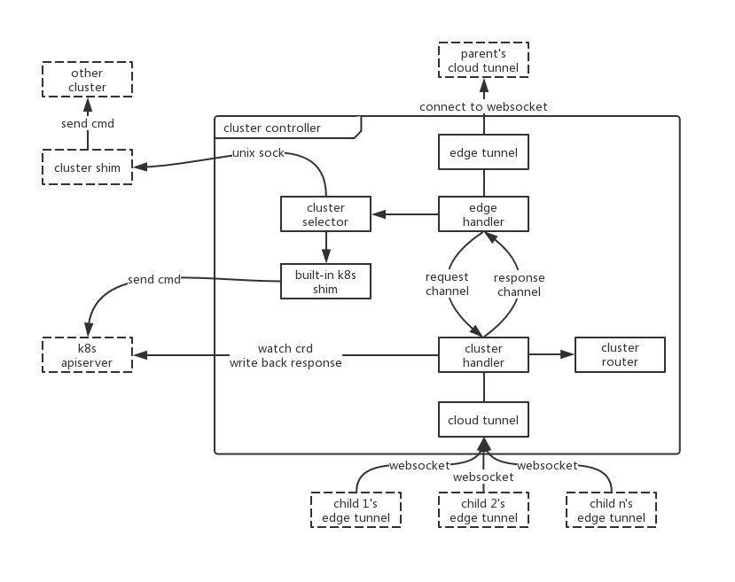

# Overview
The following figure provides a general view of ClusterController architecture:



ClusterController consists of the following components:

* [K8s CRD](../deployments/clustercontroller/clustercontroller.crd.yaml) by which you can control clusters managed by ClusterController
* [Cluster Controller](../cmd/clustercontroller) which watchs K8s CRD to manipulate cluster of current process and clusters of children

You need at least one k8s cluster to which the root cluster controller connect, and must apply K8s CRD in this k8s cluster.

## K8s CRD
There are 2 crd for cluster controller:

* Cluster: store cluster info(name, websocket address, etc.)
* ClusterController: define cluster selector and cmd to be sent to clusters

Data structure of the k8s crd is defined [here](../pkg/apis/ote/v1/types.go). If you've changed it, run [code generator](https://github.com/kubernetes/code-generator) to regenerate clientset, etc. in directory [generated](../pkg/generated). Also, there is a [script](../hack/update-codegen.sh) to do the job.

## Cluster Controller
### commandline flag
You can run `./clustercontroller help` to see flags of the program. The following describes details of some important flags:

```shell
--cluster-name 		define name of current cluster. 
					There is not need to declare this flag if this is the root cluster,
					otherwise, this flag must be set to a value except "Root"
					
--parent-cluster	define websocket address of parent cluster.
					If this is the root cluster, do not set this flag,
					otherwise, this flag must be set

--tunnel-listen		define websocket address to listen.
					It is strongly recommanded to set this flag to external_ip:external_port,
					so as to be connected to neighbor cluster's children due to connection recovery
					
--kube-config 		define config of k8s cluster which would be used to watch crd and by built-in k8s shim.
					The config file is generated by k8s when you deploy it.
					The root cluster must set this flag so it can watch k8s crd,
					otherwise, one of this and flag --remote-shim-endpoint must be set.
					If both of those two flags have been set, cmd will be sent to cluster shim in precedence
					
--remote-shim-endpoint define unix sock file of cluster shim.
```
### cluster selector
This module resolve selector in crd and decide which clusters that need to send cmd to. There are 2 things to do:

* match selector and current cluster name, send cmd to current cluster if matched
* match selector and all cluster's names in subtree, send cmd to clusters which matchs the selector

### cluster router
cluster router is consist of 2 part:

* children, neighor and parent neighbor of current cluster
* route to all clusters in subtree, the route is just like computing network route. The current cluster do not know the exact path to a certain cluster in subtree, but it knows the child through which can reach to that cluster.

### features
#### connection recovery
With the first part of cluster router, once a cluster disconnect to its parent, it can reconnect to its parent's neighbor so that can be continuously managed by root.
#### directed broadcast
With the second part of cluster router and cluster selector, a cmd can be sent to the exact clusters instead of broadcast to all clusters.
