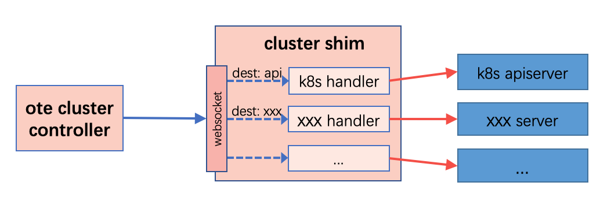

# cluster-shim
## Overview
The cluster-shim is a grpc server that handle the cluster messages forwarded by ote cluster controller and transmit to the specific destination. The diagram below shows how  cluster-shim works.

This project implements two shim for the cluster controller, which called k8s-cluster-shim and k3s-cluster-shim respectively. Both k8s-cluster-shim and k3s-cluster-shim have the same capability to interact with Kubernetes, but k8s-cluster-shim also integrates helmchart deploy capability.

## Usage
Run the binary as below. 
```shell
# same as k3s_cluster_shim
./k8s_cluster_shim --kube-config /root/.kube/config
```
The shim will start a websocket server (default ":8262"). To change the listen address use flag `--listen`.
```shell
./k8s_cluster_shim --kube-config /root/.kube/config --listen :8262
```
If you're using helm to manage applications, then you have to install [tiller proxy server](https://appscode.com/products/swift/) since we haven't implement the direct connection with tiller server yet. Before running the k8s-cluster-shim binary, You need to specify the proxy server address.
```shell
./k8s_cluster_shim --kube-config /root/.kube/config --helm-addr 127.0.0.1:8080
```
