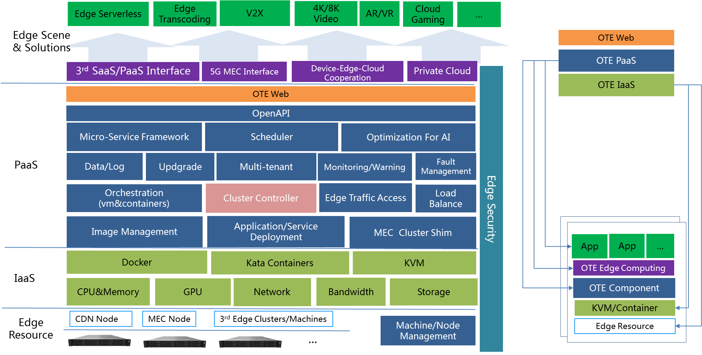
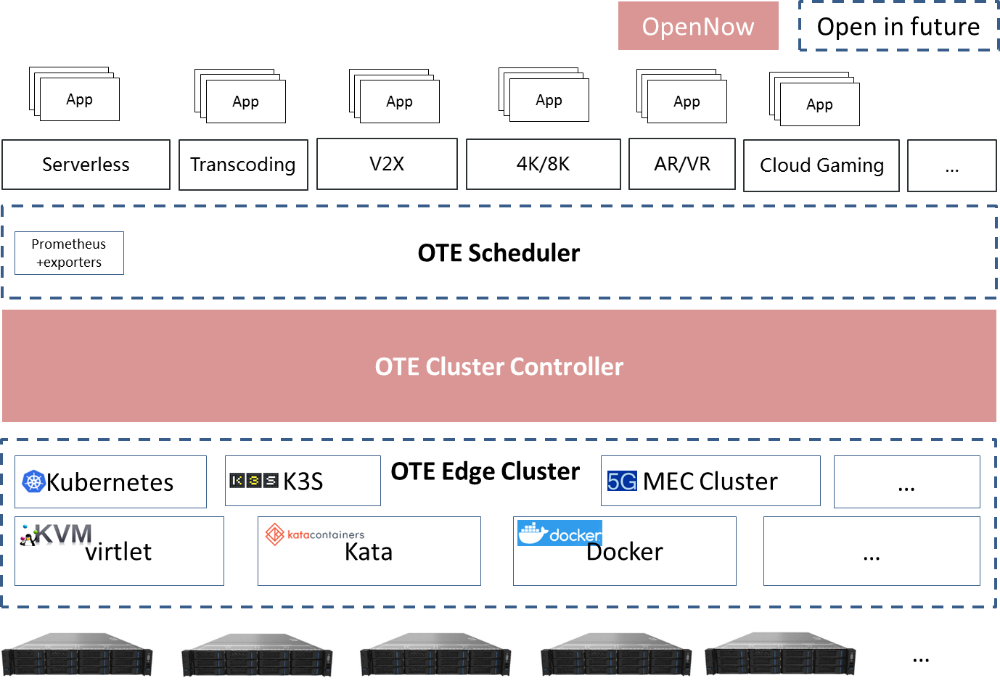
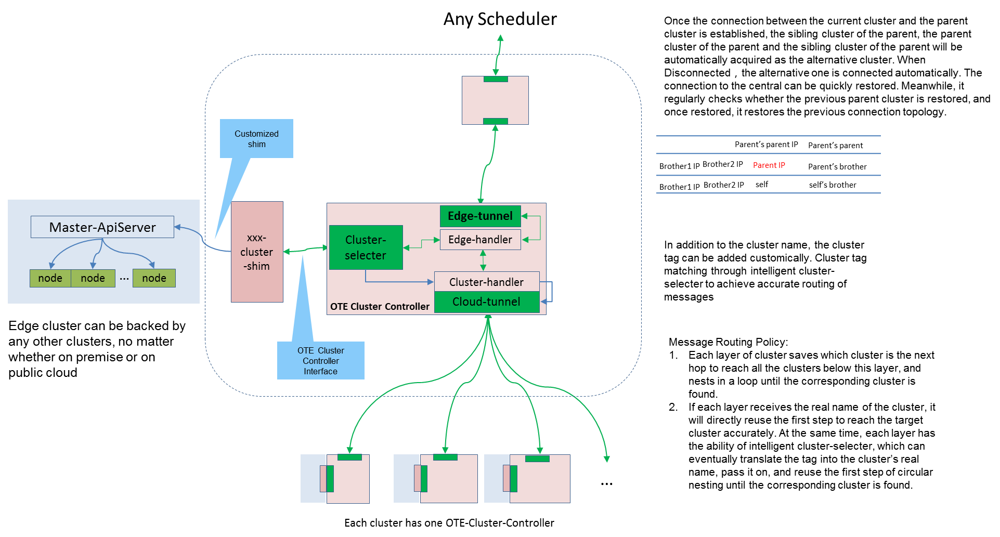
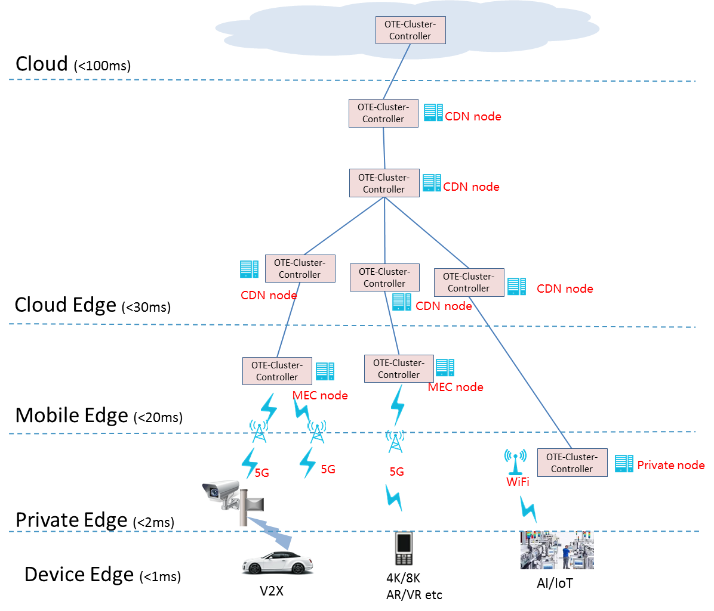
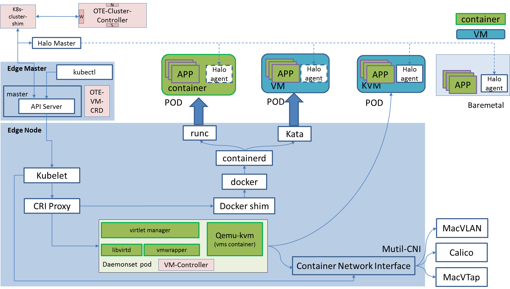

# OTE-Stack
OTE-Stack is an edge computing platform for 5G and AI. By virtualization it can shield heterogeneous characteristics and gives a unified access of cloud edge, mobile edge and private edge. For AI it provides low-latency, high-reliability and cost-optimal computing support at the edge through the cluster management and intelligent scheduling of multi-tier clusters. And at the same time OTE-Stack makes device-edge-cloud collaborative computing possible.

In the 5G era, OTE-Stack has obvious advantages in the field of edge computing:

### Large scale and hierarchical cluster management
Through the standard interface, hierarchical clusters can be built quickly. The number of clusters can be theoretically unlimited which can effectively solve the management and scheduling problems of large-scale mobile edge clusters in 5G era.

### Support third cluster
It supports kubernetes and k3s now. Because edge is a logical cluster，it can support any clusters by cluster-shim in theory. So in 5G era, it can be compatible with different implementations of different operators'MEC platforms.

### Lightweight cluster controller 
Only one component and one customize shim can make the third cluster controlled by OTE-Stack. So it's very light and easy to use.

### Cluster autonomy
The edge is a complete logical cluster which caches almost all the states. So it will run normally when it is disconnected from the center which can effectively solve the problem of cluster autonomy in the case of weak edge networks.

### Automatic disaster recovery
Because of the hierarchical design of clusters, Cluster Controller at each level will automatically acquire the alternate nodes. Once the connection with the parent node is lost, the connection with the center will be restored through the alternate nodes.

### Global scheduling
Through Cluster Controller, all the clusters can be integrated into the unified scheduling, and the global optimal use of edge resources can be achieved.

### Support multi-runtimes
OTE-Stack leverages [virtlet](https://github.com/Mirantis/virtlet) for VM-based workloads, and also adds VM operation(start，stop, mount，etc.) via CustomResourceDefinition. So it supports VM，Kata containers and runc which can orchestrate in a unified way.

### Kubernetes native support
With OTE-Stack, users can orchestrate dockers/VM on Edge clusters just like a traditional kubernetes cluster in the Cloud.

## General Design

The characteristics of edge computing:

* There are many edge nodes and they are widely distributed. The quality of the network from node to center is not guaranteed, and a certain degree of autonomy is needed.
* The number of machines in edge nodes is small, which requires lightweight virtualization.
* Considering the security isolation of multi-tenant, KVM is still needed in some scenarios.
* There are many ways to implement edge cluster (e.g. operators'MECs have their own implementations), and edge computing needs to be compatible with many schemes.
* Because the edge cluster is scattered and fragmented, the efficiency of cluster use can not be guaranteed. It needs global or local scheduling to ensure the optimal use of resources.

Considering the above characteristics, a lightweight autonomous Cluster is needed at the edge, a unified Scheduler is needed at the center to ensure the optimal use of resources, and a cluster management component-**Cluster Controller**, is needed between scheduling and edge cluster to meet edge autonomy and achieve unified scheduling. OTE-Stack is designed according to the above ideas.

At present, kubernetes has gradually become the mainstream edge orchestration method in the industry. OTE-Stack takes k8s as an example to design a software stack suitable for edge large-scale cluster management and scheduling. Subsequently, the management of edge clusters such as [k3s](https://github.com/rancher/k3s), [kubeedge](https://github.com/kubeedge/kubeedge) and 5G MEC will be compatible. Finally, the interface standard of OTE-Stack for edge cluster management will be formed. Shim of third-party cluster will be implemented according to the standard, and any third-party cluster will be integrated into OTE-Stack for unified management and scheduling. Third-party cluster can still have its own cluster management platform without any influence on each other. 

At the same time, OTE-Stack combines [virtlet](https://github.com/Mirantis/virtlet) to give a reference implementation of unified orchestration of VM and container. Virtualized resources exported to the outside world will be standardized as KVM, Kata Containers and Docker. This open source is mainly **OTE Cluster Controller**, and the implementation of open source edge cluster and the design of global scheduling will follow. Please look forward to it.

## Architecture

As shown in the figure, OTE-Stack is implemented around three parts: edge cluster design, large-scale cluster management and global scheduling. The scheduling part is currently not open source; for edge cluster, OTE-Stack gives a reference design of mixing VM and container; the management of large-scale cluster relies on **OTE Cluster Controller** component, which includes the following components:

* Edge Tunnel
> Northbound interface of Controller. By establishing websocket connection with **CloudTunnel** of upper cluster, messages between clusters can be transmitted smoothly.

* Edge Handler
> It can add tags to cluster, receive and process messages from upper cluster, transmit messages to **ClusterHandler**, receive messages from **ClusterHandler** and realize cluster disaster recovery automatically.
   * Users can configure their own cluster name or add cluster tags to achieve complex cluster management.
   * Used for receiving messages sent by **EdgeTunnel** and forwarding them to **Cluster Selecter** for routing or direct transmission to **ClusterHandler** after processing.
   * Receive messages sent back by **ClusterHandler** or shim (such as changes in sub-cluster, status, etc.) and pass them to the upper cluster through **EdgeTunnel** after processing.
   * Once the connection between the current cluster and the parent cluster is established, the sibling cluster of the parent, the parent cluster of the parent and the sibling cluster of itself will be automatically acquired as the alternative cluster. When Disconnected，the alternative one is connected automatically. The connection to the central can be quickly restored. Meanwhile, it regularly checks whether the previous parent cluster is restored, and once restored, it restores the previous connection topology.

* Cluster Selecter
> It is used to complete the routing of cluster messages, and it accepts the processing of two kinds of cluster routing rules.
   * If it is a real list of cluster names, it matches the names according to the cluster routing rules and looks for the next hop until it reaches the specified cluster accurately.
   * If it's a cluster's fuzzy rules, such as\* tagA*, it matches all tagA-containing clusters in the tag and maps them to the real names of the clusters. Then it uses the above rules to pass down until it reaches the specified cluster accurately.
 
* Cluster Handler 
> It's core components of cluster management.
   * Store the names and labels of all subclusters.
   * Establish routing rules that store the next hop cluster name to any sub-cluster to support accurate delivery of messages.
   * Notify the upper cluster in time when the sub-cluster changes (such as disconnection, status updates, etc.)
   * Watch the changes of **ClusterController** CRD in current cluster and respond accordingly. It's optional. If the current cluster is not managed by k8s, it can not be configured; Otherwise, it is compatible with the operation through kubectl.

* Cloud Tunnel
> Southbound interface of Controller. By establishing websocket connection with **EdgeTunnel** of sub-cluster, messages between clusters can be transmitted smoothly.

The main purpose of **OTE Cluster Controller** is to complete large-scale cluster access, cluster disaster tolerance, duplex channel of cluster messages, and basic deployment and deletion. Therefore, OTE-Stack demonstrates the unified management of multi-tier clusters with k8s and k3s as examples, and gives the initial implementation of cluster shim (which will be abstracted into standards later).

## Cluster controller

* Cluster Controller designs standard northbound and southbound interfaces for the rapid establishment of hierarchical clusters, which can support large-scale cluster management.
* The westward interface completes the control of the cluster, and realizes the custom shim according to the OTE cluster access standard, which can complete the access of any cluster.
* Fast disaster recovery can be achieved by obtaining the information of alternative clusters.
* Through the naming and labeling mechanism of the cluster, the detailed management of the cluster is completed.
* The precise forwarding of cluster messages is accomplished by establishing message routing strategy.
* Because the sub-cluster keeps almost complete cluster control and state, it realizes cluster autonomy.

## Multi-level Edge

With the help of hierarchical cluster management concept, the device, mobile edge, cloud edge and cloud center are connected to form a huge cluster management tree. Through centralized scheduling, combined with the computing load and business priority of the actual edge cluster, the collaborative scheduling of each level is completed, and the collaborative computing of devcie-edge-cloud is preliminarily realized, which provides the basis for the subsequent collaborative computing framework.

## Multi-runtime 

* The open source project virtlet completes the unified orchestration and scheduling of VM, container and Kata Containers.
* The single instance management of VM is realized by CRD.
* Because the VM network is built by macvtap, there is no available macvtap CNI plug-in, so OTE-Stack provides the CNI implementation of macvtap.
* Halo completes the management and maintenance of Apps in containers or virtual machines (Halo is a component of Baidu's internal application management, not yet open source)