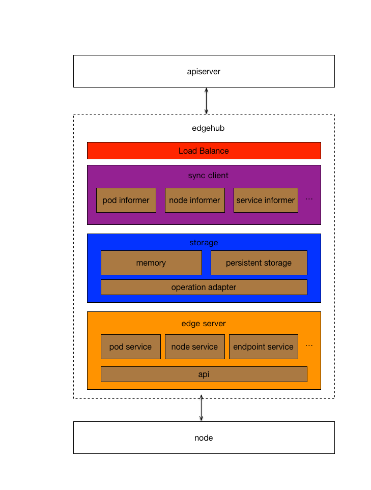
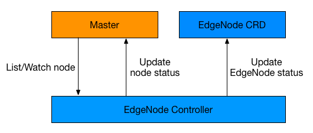

# Edge Autonomy

## Overview
In order to solve the problem that in the weak network environment, when the edge node of the cluster is disconnected from the central node, it can still work normally, we proposed a solution using EdgeHub+EdgeController.
* [EdgeHub](../cmd/edgehub) needs to proxy the behavior of the master on the node,and provides services for kubelet and kube-proxy. 
* [EdgeController](../cmd/edgecontroller) is used to take over the state management of the node when the node is disconnected from the master. Through the CRD+Operator mode, it creates a CRD instance for each node to ensure that the node's performance on ETCD is alive and normal. The true state is recorded on the corresponding CRD resource.

## k8s crd
* [EdgeNode](../deployments/kube-apiserver/edgenode-crd.yml.tpl) stores the true status of the edge node

## EdgeHub


* edge server: As a proxy of apiserver on nodes, it provides service access for kubelet and kube-proxy.
* storage: It stores resource information fully synchronized with etcd for use by the edge server. Storage includes two storage methods: memory and persistent storage, where the memory uses the cache that comes with the informer; persistent storage is used as backup storage.
* sync client: It acts as a client that synchronizes resources between the edgehub and the master. It uses the informer mechanism to synchronize etcd resource information and stores it in the storage.
* load balancer: It is a forwarding agent between EdgeHub and master, which determines how to handle requests initiated by nodes by detecting the availability of master.

## EdgeController

* EdgeNode Controller: It monitors the status change of the node through informer, and creates a corresponding crd resource EdgeNode in the master for each node. Once it is found that node is in the NotReady state, it immediately replaces the original node for status reporting and updates the corresponding EdgeNode resource status to NotReady.
* EdgeNode CRD: It is a custom resource type for nodes, and used to store the actual state of nodes for query and display.

## How to use
### 1. Example for deploying EdgeHub
#### For k8s cluster
* Modify the kubelet-bootstrap.conf file of kubelet, the server field points to the listening address of EdgeHub's edge server, the default is: https://127.0.0.1:8778.And kubelet should add startup parameters: --kube-api-content-type=application/json

* Modify the kube-proxy.conf file of kube-proxy, the server field points to the listening address of EdgeHub's edge server, the default is: https://127.0.0.1:8778. And kube-proxy adds startup parameters: --kube-api-content-type=application/json

* Copy the certificate of k8s apiserver, including three files ca.pem, kube-apiserver.pem, kube-apiserver-key.pem. Rename kube-apiserver.pem to edge-server.pem and rename kube-apiserver-key.pem to edge-server-key.pem

* Copy the kubeconfig file to the working directory, modify the server field of the kubeconfig file to point to the listening address of the EdgeHub load balancer, the default is: https://127.0.0.1:6888.

* Start EdgeHub
```shell
./ote_edgehub k8s -v 2 --kube-config kubeconfig --init-server master_ip:8081
```

#### For k3s cluster
* Set k3s agent startup parameters
```shell
--server=https://127.0.0.1:8778
--kubelet-arg=kube-api-content-type=application/json
--kube-proxy-arg=kube-api-content-type=application/json
```

* Create the ssl directory under the working directory, and copy the k3s certificate files server-ca.crt, server-ca.key and token to the ssl directory. Rename server-ca.crt to edge-server.pem, and rename server-ca.key to edge-server-key.pem.

* Copy the kubeconfig file to the working directory, modify the server field of the kubeconfig file to point to the listening address of the EdgeHub load balancer, the default is: https://127.0.0.1:6888.

* Start EdgeHub
```shell
./ote_edgehub k3s -v 2 --kube-config kubeconfig --init-server master_ip:8081
```

If you want more info from EdgeHub, please use its help.

### 2. Example for deploying EdgeController
* First need to create [EdgeNode CRD](../deployments/kube-apiserver/edgenode-crd.yml.tpl)
```shell
kubectl apply -f edgenode-crd.yml
```
* Run edge-controller on a master node of the k8s or k3s cluster
```shell
./ote_edgecontroller -v 2 -kubeconfig /root/.kube/config
```

You can also deploy EdgeController in a cluster in a containerized manner. The specific deployment method has been integrated in the script.For details, please see [install-scripts.md](./install-scripts.md).

