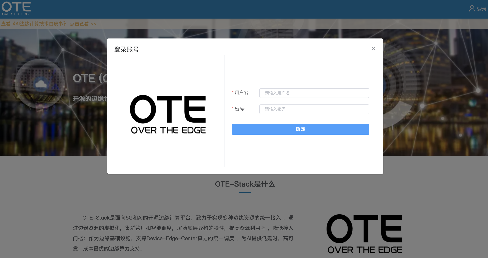
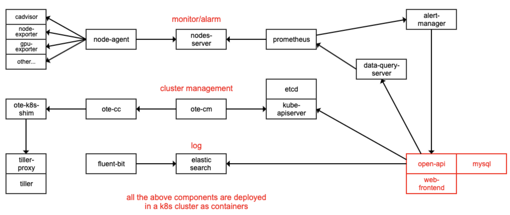
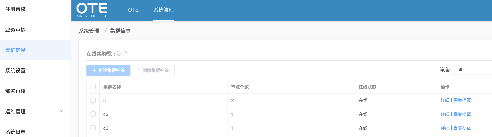
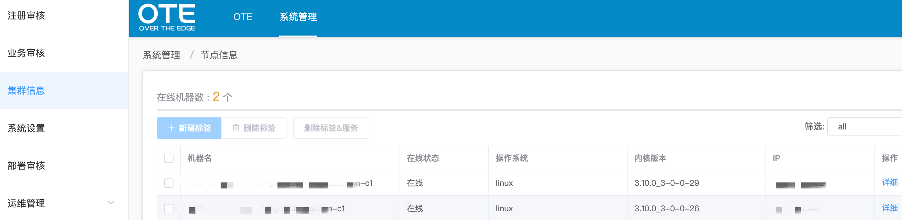
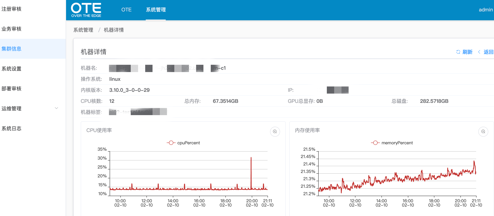

# Install Scripts for the single cluster

To better understand ote-stack, we provide shell scripts for rapid installment.

In the **deployments** directory, we have these files and subdirectories.

| interface_conf | the config file for create_yml.sh to use |
| :------------: | ------------------------------------------------------------ |
| create_yml.sh  | the shell script for creating actual YAML file according to YAML template |
|  apply_yml.sh  | the shell script for installing ote-stack                    |


## 0. Prerequisite

- You should have at least one k8s or k3s cluster in which container network is healthy (coredns works).If you want to enable edge autonomy feature in your cluster, you should deploy EdgeHub according to [edge-autonomy.md](./docs/edge-autonomy.md)

- Kubectl works with default kubeconfig in the /root/.kube/ directory

- Available [harbor](https://goharbor.io/) with admin user and password


## 1. Installment

- Chang config file interface_conf according to the comment. If you want to enable edge autonomy feature, you should set EDGE_AUTONOMY_ENABLE to be true

- Create actual yml

  ```shell
  sh create_yml.sh start
  ```

- Apply actual yml

  ```shell
  sh apply_yml.sh start
  ```

  Note: Timeout may occur when pulling images after the shell script is executed. Thus you can solve this problem by executing the command
  
  ```shell
  kubectl delete -f xxx.yml && kubectl apply -f xxx.yml
  # xxx.yml means the xxx module deployment YAML file
  ```

- Check 

  If you can use the ote-web platform normally as the picture below, it means that ote-stack was installed successfully.

  
  

# Upgrade from the single cluster to multiple clusters

Usually the single cluster is able to meet the requirements for the most part of private cloud. However the number of nodes managed by one cluster is limited or sometimes you have serveral private clouds deployed in the different area. These are the reasons why you need multi-cluster management.

The ote-stack supports both single cluster and multi-cluster management. In the above section, we talk about how to install ote-stack in the single cluster. Here we are gonna talk about how to upgrade ote-stack from the single cluster to multiple clusters.

## Single cluster architecture



As shown above, all modules are deployed in the single cluster which is called both edge cluster and root cluster. If you wanna upgrade to multi-cluster management, the only way that you need to do is deploying necessary modules in the new edge cluster. Modules deployed in the edge cluster are as follows:

- tiller/ tiller-proxy/ ote-shim/ ote-cc
- node-agent/ nodes-server/ prometheus
- exporters like cadvisor/ node-exporter/ gpu-exporter (optional)
- fluent-bit (optional)

## Multiple clusters architecture


After deploying the necessary modules in the new edge cluster, the architecture looks like the above picture. As you can see, the connections between root cluster and edge cluster are ote-cc, prometheus and fluent-bit which are marked in blue.

The edge ote-cc reports the edge cluster info to root ote-cc and receives root ote-cc instructions to control the cluster. The edge fluent-bit reports the edge cluster container logs to root cluster. The edge prometheus provides the edge cluster monitor info for root prometheus to pull.

## Simple Example with using ote-web

Now you can use ote-web to control all the edge clusters. For example, there are 3 clusters which are called c1, c2, c3 and we can easily know the cpuPercent, memoryPercent usage of the node with ote-web.

- check all the clusters status


- chose c1 cluster


- query node info in the c1 cluster



