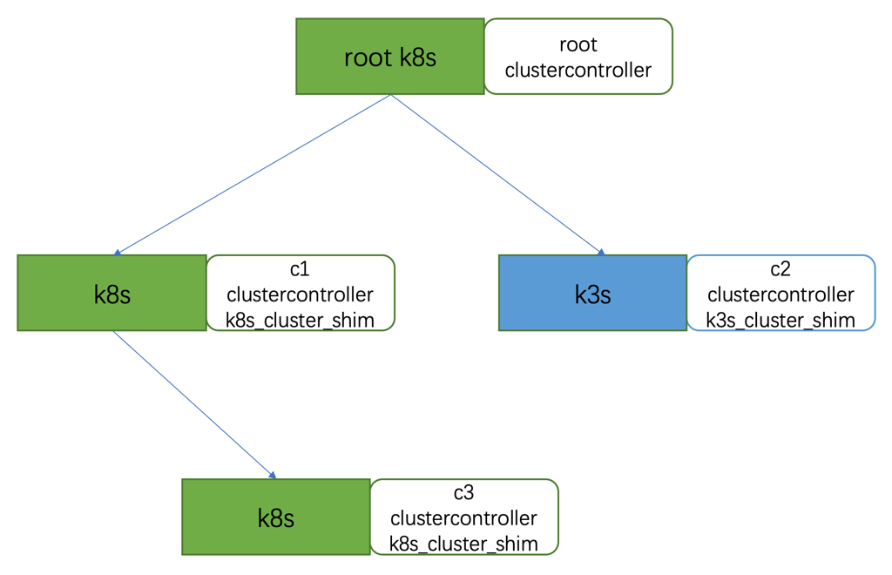
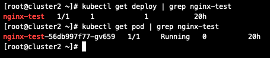

# How to build

## Download

```shell
cd $GOPATH/src
mkdir -p github.com/baidu
cd github.com/baidu
git clone https://github.com/baidu/ote-stack
```

## Compile

If your go version is equal to or greater than 1.12, we recommend that you use the build.sh to compile.

```shell
// compile (compiled binary programs in the output/bin directory)
bash build/build.sh build
```

Otherwise you have to download the dependent go package by yourself for compiling.

```shell
go get github.com/kubernetes/kubernetes
go get github.com/gorilla/mux

export GO111MODULE=off

// compile (compiled binary programs in their own directory)
cd $GOPATH/src/github.com/baidu/ote-stack/cmd/clustercontroller && go build clustercontroller.go
cd $GOPATH/src/github.com/baidu/ote-stack/cmd/k8s_cluster_shim && go build k8s_cluster_shim.go
cd $GOPATH/src/github.com/baidu/ote-stack/cmd/k3s_cluster_shim && go build k3s_cluster_shim.go
```

# How to use

In order to give you a better understanding of what clustercontroller is and how it works, here's a simple example of managing multi clusters such as k8s cluster and k3s cluster with clustercontroller.

The simple example is that we can easily deploy a nginx app after we use clustercontroller to take control of k8s cluster and k3s cluster. The example architecture overview is as follows:



As is shown above in the picture,  architecture overview looks like a tree. Each cluster has one clustercontroller and one cluster_shim which are used for managing cluster and you can manage all the k8s clusters or k3s clusters or other clusters with the root clustercontroller. For the root k8s cluster,  k8s_cluster_shim is optional.

## 0. Prerequisite

- In order to complete this example above, you should have at least two k8s clusters and one optional k3s cluster. If not, please refer to [install k8s cluster](https://kubernetes.io/docs/setup/production-environment/tools/kubeadm/create-cluster-kubeadm/) and [install k3s cluster](https://k3s.io/).

## 1. Build cluster management

After compiling, you've got the clustercontroller and cluster_shim (k3s_cluster_shim, k8s_cluster_shim) binary programs. To build cluster management, all you have to do is deploy these two binary programs to cluster. In order to make it easy,  we just deploy these binary programs on the k8s master machine or k3s master machine (kubectl connects to the k8s master or k3s master with default kubeconfig is /root/.kube/config).

### For the root k8s cluster

- create the crd with clustercontroller.crd.yaml on the k8s master machine.


```shell
// ote.crd.yaml is in the project dir $GOPATH/src/github.com/baidu/ote-stack/deployments/clustercontroller

kubectl apply -f clustercontroller.crd.yaml
```
- start the root clustercontroller on the k8s master machine.

```shell
./clustercontroller --v 3
```

### For the other k8s cluster or k3s cluster

- start the k8s_cluster_shim on the k8s master machine or start the k3s_cluster_shim on the k3s master machine.

```shell
./k8s_cluster_shim -l :8262  -v 3 // for k8s cluster
./k3s_cluster_shim -l :8262  -v 3 // for k3s cluster
```
- start the clustercontroller on the k8s master machine or k3s master machine.

```shell
./clustercontroller --parent-cluster parent_cluster_ip:8287 -v 3 -n c1 --remote-shim-endpoint shim_ip:8262 -l self_ip:8287
```

Look at the standard output to check whether these two binary programs succeed to start. If the messages look like this, it indicates that the startup is successful.


Here parent_cluster_ip:8287 is the address of parent cluster, for example, parent_cluster_ip is the root k8s master ip. And c1 represents which clustercontroller is. You can fill in any string but must make sure it should be unqiue globally. For self_ip is the ip on which clustercontroller listens, and shim_ip is the ip of host on which cluster shim listens.

If you wanna build more level cluster management, for example, let the c3 clustercontroller be the child of c1 clustercontroller, just start the c3 clustercontroller with parent-cluster arg being the address of c1.


If you want more info from clustercontroller or cluster_shim, please use its help.

```shell
[root@cluster2 clustercontroller]# ./clustercontroller --help
clustercontroller connects to the others to make a ote cluster,
		which can connect to other cluster like k8s

Usage:
  clustercontroller [flags]
  clustercontroller [command]

Available Commands:
  help        Help about any command
  version     Show version

Flags:
      --alsologtostderr                  log to standard error as well as files
  -n, --cluster-name string              Current cluster name, must be unique (default "Root")
  -t, --helm-tiller-addr string          helm tiller http proxy addr
  -h, --help                             help for clustercontroller
  -k, --kube-config string               KubeConfig file path (default "/root/.kube/config")
      --log-flush-frequency duration     Maximum number of seconds between log flushes (default 5s)
      --log_backtrace_at traceLocation   when logging hits line file:N, emit a stack trace (default :0)
      --log_dir string                   If non-empty, write log files in this directory
      --log_file string                  If non-empty, use this log file
      --logtostderr                      log to standard error instead of files (default true)
  -p, --parent-cluster string            Websocket address to parent cluster
  -r, --remote-shim-endpoint string      remote cluster shim address
      --skip_headers                     If true, avoid header prefixes in the log messages
      --stderrthreshold severity         logs at or above this threshold go to stderr (default 2)
  -l, --tunnel-listen string             Tunnel address to listen (default ":8287")
  -v, --v Level                          number for the log level verbosity
      --vmodule moduleSpec               comma-separated list of pattern=N settings for file-filtered logging

Use "clustercontroller [command] --help" for more information about a command.

[root@cluster2 clustercontroller]# ./k8s_cluster_shim --help
k8s_cluster_shim is a middleware between clustercontroller and k8s cluster

Usage:
  k8s_cluster_shim [flags]
  k8s_cluster_shim [command]

Available Commands:
  help        Help about any command
  version     Show version

Flags:
      --alsologtostderr                  log to standard error as well as files
      --helm-addr string                 Helm proxy address
  -h, --help                             help for k8s_cluster_shim
  -k, --kube-config string               KubeConfig file path (default "/root/.kube/config")
  -l, --listen string                    Websocket address of ClusterShim (default ":8262")
      --log-flush-frequency duration     Maximum number of seconds between log flushes (default 5s)
      --log_backtrace_at traceLocation   when logging hits line file:N, emit a stack trace (default :0)
      --log_dir string                   If non-empty, write log files in this directory
      --log_file string                  If non-empty, use this log file
      --log_file_max_size uint           Defines the maximum size a log file can grow to. Unit is megabytes. If the value is 0, the maximum file size is unlimited. (default 1800)
      --logtostderr                      log to standard error instead of files (default true)
      --skip_headers                     If true, avoid header prefixes in the log messages
      --skip_log_headers                 If true, avoid headers when opening log files
      --stderrthreshold severity         logs at or above this threshold go to stderr (default 2)
  -v, --v Level                          number for the log level verbosity
      --vmodule moduleSpec               comma-separated list of pattern=N settings for file-filtered logging

Use "k8s_cluster_shim [command] --help" for more information about a command.
```

## 2. Deploy the nginx app

After succeeding to build cluster management, we can deploy an nginx app with root clustercontroller.

```
{
  "apiVersion": "ote.baidu.com/v1",
  "kind": "ClusterController",
  "metadata": {
    "name": "nginx-test",
    "namespace": "kube-system"
  },
  "spec": {
    "body": "{\"apiVersion\": \"extensions/v1beta1\",\"kind\": \"Deployment\",\"metadata\": {\"labels\": {\"app\": \"nginx\"},\"name\": \"nginx-test\",\"namespace\": \"default\"},\"spec\": {\"replicas\": 1,\"selector\": {\"matchLabels\": {\"app\": \"nginx\"}},\"template\": {\"metadata\": {\"labels\": {\"app\": \"nginx\"}},\"spec\": {\"containers\": [{\"image\": \"nginx\",\"name\": \"nginx\",\"ports\": [{\"containerPort\": 80,\"protocol\": \"TCP\"}]}]}}}}",
    "clusterSelector": "c1,c2,c3",
    "destination": "api",
    "method": "POST",
    "url": "/apis/extensions/v1beta1/namespaces/default/deployments"
  }
}
```

Create test.json like this,  use kubectl on the root k8s master machine.
```
kubectl apply -f test.json
```

The test.json tells the c1, c2, c3 clustercontroller to deploy the nginx app called nginx-test to their own k8s cluster or k3s cluster that they manage.

After you run the above command, go to any cluster like c1 to check whether it's successful.

```
kubectl get pod
kubectl get deploy
```


